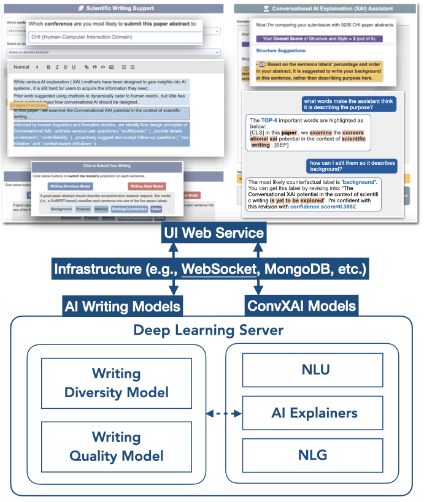

# ConvXAI
This repository includes code for the ConvXAI system as described in the paper:

>[“Hey ConvXAI , how should I improve?”: Towards Conversational Explainable AI Support for Scientific Writing](https://hua-shen.org/assets/files/convxai.pdf)  
> Hua Shen, Chieh-Yang Huang, Tongshuang Wu, Ting-Hao (Kenneth) Huang.
> Arxiv, 2022.


Bibtex for citations:
```bibtex
 @inproceedings{convxai:arxiv:2022,  
 author = {Hua Shen and Chieh-Yang Huang and Tongshuang Wu and Ting-Hao (Kenneth) Huang},  
 title = {“Hey ConvXAI, how should I improve?”: Towards Conversational Explainable AI Support for Scientific Writing},  
 booktitle = {Arxiv},  
 year = {2022}
 }
```


Table of Contents
=================

   * [ConvXAI](#convxai)
      * [Table of Contents](#table-of-contents)
      * [Prerequisites](#prerequisites)
         * [Installation](#installation)
         * [MongoDB Setup](#mongodb-setup)
         * [Download Pretrained Data and Models](#download-pretrained-data-and-models)
         * [Config Files Setup](#config-files-setup)
      * [How to run ConvXAI](#how-to-run-convxai)
         * [Run the server](#run-the-server)
         * [Run the client](#run-the-client)
      * [ConvXAI Tutorials](#convxai-tutorials)
         * [1. ConvXAI Overview](#1-covnxai-overview)
         * [2. UI Web Service](#2-ui-web-service)
         * [3. AI Writing Models](#3-ai-writing-models)
         * [4. Conversational XAI Models](#4-conversational-xai-models)
         * [5. System Infrastructure](#5-system-infrastructure)


## Prerequisites


### Installation
**Create** a `convxai` virtual environment, **activate** the environment, and **install** the libraries for ConvXAI as below.
```
$conda create --name convxai python=3.7
$conda activate convxai
$pip install -r requirements.txt
```

<!-- TODO
From Pypi:
```bash
pip install convxai
```

From source:
```bash
git clone git@github.com:huashen218/convxai.git
cd convxai
pip install -e .
```
 -->


### MongoDB setup
ConvXAI system is built upon [MongoDB](https://www.mongodb.com/) database. Please install [MongoDB](https://www.mongodb.com/) on your node and ensure you have the database access to connect and manage the data.
Then refer to the [Config Files Setup](#config-files-setup) section to set up [`mongodb_config.yml`](convxai/configs/mongodb_config.yml).

### Config Files Setup
Setup the  configs files of ConvXAI at `convxai/configs`:

   * [mongodb_config.yml](convxai/configs/mongodb_config.yml):  You can either deploy both server and client in the **same machine** setting `mongo_host: localhost`, or you can deply them on **two machines** and set your client machine's IP address as mongo_host, e.g., `mongo_host: "157.230.188.155""`.

```
mongo_host: localhost
mongo_db_name: convxai
```


   * [configs.yml](convxai/configs/configs.yml)


```
## convxai/configs/configs.yml
scientific_writing:
    diversity_model_dir: "huashen218/convxai-diversity-model"
    quality_model_dir: "huashen218/convxai-quality-model"
```


```

conversational_xai:
    checkpoints_root_dir: "/home/hqs5468/hua/workspace/projects/convxai/checkpoints/xai_models/"
    xai_example_dir:
        xai_emample_embeddings_dir:
            ACL: "xai_example_embeddings/diversity_model_ACL_embeddings.h5"
            CHI: "xai_example_embeddings/diversity_model_CHI_embeddings.h5"
            ICLR: "xai_example_embeddings/diversity_model_ICLR_embeddings.h5"
        xai_emample_texts_dir:
            ACL: "xai_example_embeddings/diversity_model_ACL_texts.h5"
            CHI: "xai_example_embeddings/diversity_model_CHI_texts.h5"
            ICLR: "xai_example_embeddings/diversity_model_ICLR_texts.h5"
    xai_writing_aspect_prediction_dir: "/xai_writing_aspect_prediction"
    xai_counterfactual_dir: "xai_writing_aspect_prediction/"
```

   * [service_config.yml](convxai/configs/service_config.yml): In the common case, you don't need to modify this file unless you want to change the `relative paths` or the `class names` inside of `service_config.yml`.


### Check pretrained data and models
You can skip this step if you are going to use the default datasets and models of ConvXAI system. ConvXAI repository is self-contained, including:
- **Two AI writing models**: are uploaded to Huggingface Hub. One is a *SciBERT-based classification* model (i.e., `huashen218/convxai-quality-model`), the other is a *GPT-based generative* model (i.e., `huashen218/convxai-quality-model`). The models will be automatically downloaded when deploying ConvXAI.
- **CIA dataset**: collects paper abstracts from 2018-2022 in **C**HI, **I**CLR and **A**CL conferences. CIA dataset is for finetuning *GPT-based* model to generate scientific style quality scores. Data path is: `data/CIA`.
- **XAI models**: contains pretrained checkpoints supporting conversational XAI modules to generate AI comments and explanations on-the-fly. Particularly, the `checkpoints/` include:
   * `xai_writing_aspect_prediction/`: enables xai_models to generate AI comments related to the submitted paper's apsect label distribution.
   * `xai_example_embeddings/`: saves embeddings from CIA datasets to enable xai_models to generate example-based explanations. The method is **NN\_DOT** method described in [this paper](https://aclanthology.org/2021.naacl-main.75.pdf)
   * `xai_counterfactual_explainer_models/`: contains [MiCE](https://aclanthology.org/2021.findings-acl.336.pdf) counterfactual model pre-trained on our writing structure model.

You can also train your own writing and XAI models from scratch. Please refer to the [ConvXAI Tutorial](#convxai-tutorials) for details.


## How to Run ConvXAI

Open two terminals for running the server.
### Run the server:
One terminal runs the server with:
```
$bash path_to_convxai/convxai/runners/main_server.sh
```

### Run the client:
The other terminal runs the client with:
```
$bash ath_to_convxai/convxai/runners/main_client.sh
```

Then have fun chatting with ConvXAI robot for improving your paper writing!


## ConvXAI Tutorials


### 1. CovnXAI Overview

We demonstrate the architecture of ConvXAI in Figure1. ConvXAI mainly includes **four modules** summarized below. We further introduce details of each module in the following sections. 
- **UI web service** (i.e., in **client**) using [Flask](https://flask.palletsprojects.com/en/2.2.x/) to support human-AI interactions; 
- **Deep learning AI writing models** (i.e., in **server**) to generate AI predictions;
- **Conversational XAI models** (i.e., in **server**) to receive user questions and generate free-text XAI responses; 
- **System Infrastructures** (e.g., [WebSocket](https://en.wikipedia.org/wiki/WebSocket) protocol, [MongoDB](https://www.mongodb.com/) database) to support communication between the client and server.


<!-- |  |  -->
| | 
|:--:| 
| **Figure1. Overview of the Architecture of ConvXAI** |


### 2. UI Web Service

ConvXAI deploys UI with [Flask](https://flask.palletsprojects.com/en/2.2.x/).


### 3. AI Writing Models

We include two AI models to support scientific writing.


### 4. Conversational XAI Models

We design our ConvXAI module to include Natural Language Understanding (NLU), AI Explainers (XAIers), Natural Language Generation (NLG) modules.


### 5. System Infrastructure

We build ConvXAI upon the [ParlAI](https://parl.ai/) platform to for the server-client architecture.


ConvXAI uses [PyMongo](https://pymongo.readthedocs.io/en/stable/) python package to work with MongoDB.


