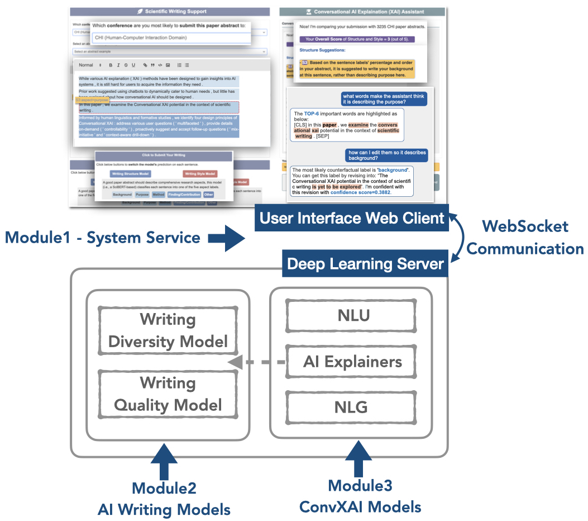

[src_logo_w/o_text]:"assets/logo_wotext.png"
[src_logo_text]: "assets/logo_new.png"


# ConvXAI
This repository includes code for the ConvXAI system as described in the paper:

>[“Hey ConvXAI , how should I improve?”: Towards Conversational Explainable AI Support for Scientific Writing](https://hua-shen.org/assets/files/convxai.pdf)  
> Hua Shen, Chieh-Yang Huang, Tongshuang Wu, Ting-Hao (Kenneth) Huang.
> Arxiv, 2022.


Bibtex for citations:
```bibtex
 @inproceedings{convxai:arxiv:2022,  
 author = {Hua Shen and Chieh-Yang Huang and Tongshuang Wu and Ting-Hao (Kenneth) Huang},  
 title = {“Hey ConvXAI, how should I improve?”: Towards Conversational Explainable AI Support for Scientific Writing},  
 booktitle = {Arxiv},  
 year = {2022}
 }
```


Table of Contents
=================

   * [ConvXAI](#convxai)
      * [Table of Contents](#table-of-contents)
      * [Prerequisites](#prerequisites)
         * [Installation](#installation)
         * [MongoDB Setup](#mongodb-setup)
         * [Download Pretrained Data and Models](#download-pretrained-data-and-models)
         * [Config Files Setup](#config-files-setup)
      * [How to run ConvXAI](#how-to-run-convxai)
         * [Run the server](#run-the-server)
         * [Run the client](#run-the-client)
      * [ConvXAI Tutorials](#convxai-tutorials)
         * [1. ConvXAI Overview](#1-covnxai-overview)
         * [2. UI Web Service](#2-ui-web-service)
         * [3. AI Writing Models](#3-ai-writing-models)
         * [4. Conversational XAI Models](#4-conversational-xai-models)
         * [5. System Infrastructure](#5-system-infrastructure)


## Prerequisites

### Installation
**Create** a `convxai` virtual environment, **install** the libraries for ConvXAI as below, and **activate** the environment.
```
$pip install -r requirements.txt
```

### MongoDB Setup
2. Besides, ConvXAI system is built upon [MongoDB](https://www.mongodb.com/) database. Please install it and setup the configs (as described in `4` below).


### Download Pretrained Data and Models
3. `Download` the [datasets]() and [pre-trained models]().

You need to download the pretrained datasets and models for ConvXAI to generate AI predictions and AI explanations. You can also train your own models from scratch, the detailed instructions are described in the [ConvXAI Tutorial](#convxai-tutorials).

   * Writing models: 

   * XAI models:

```$wget https://www.dropbox.com/sh/9qv9bixnj0xl3dm/AACK-G19UBv4aGIW2aqO9YEJa?dl=0```


### Config Files Setup
4. Setup the  configs files of ConvXAI at `convxai/configs`:

   * [mongodb_config.yml](convxai/configs/mongodb_config.yml):  You can either deploy both server and client in the **same machine** setting `mongo_host: localhost`, or you can deply them on **two machines** and set your client machine's IP address as mongo_host, e.g., `mongo_host: "157.230.188.155""`.

   * [configs.yml](convxai/configs/configs.yml)

   * [service_config.yml](convxai/configs/service_config.yml): In the common case, you don't need to modify this file unless you want to change the `relative paths` or the `class names` inside of `service_config.yml`.


## How to Run ConvXAI

Open two terminals for running the server.
### Run the server:
One terminal runs the server with:
```
$bash path_to_convxai/convxai/runners/main_server.sh
```

### Run the client:
The other terminal runs the client with:
```
$bash ath_to_convxai/convxai/runners/main_client.sh
```

Then have fun chatting with ConvXAI robot for improving your paper writing!


## ConvXAI Tutorials


### 1. CovnXAI Overview

We demonstrate the architecture of ConvXAI in Figure1. ConvXAI mainly includes **four modules** summarized below. We further introduce details of each module in the following sections. 
- **UI web service** (i.e., in **client**) using [Flask](https://flask.palletsprojects.com/en/2.2.x/) to support human-AI interactions; 
- **Deep learning AI writing models** (i.e., in **server**) to generate AI predictions;
- **Conversational XAI models** (i.e., in **server**) to receive user questions and generate free-text XAI responses; 
- **Infrastructures** (e.g., [WebSocket](https://en.wikipedia.org/wiki/WebSocket) protocol, [MongoDB](https://www.mongodb.com/) database) to support communication between the client and server.


|  | 
|:--:| 
| **Figure1. Overview of the Infrastructure of ConvXAI** |
<!--  -->


### 2. UI Web Service

ConvXAI deploys UI with [Flask](https://flask.palletsprojects.com/en/2.2.x/).


### 3. AI Writing Models

We include two AI models to support scientific writing.


### 4. Conversational XAI Models

We design our ConvXAI module to include Natural Language Understanding (NLU), AI Explainers (XAIers), Natural Language Generation (NLG) modules.


### 5. System Infrastructure

We build ConvXAI upon the [ParlAI](https://parl.ai/) platform to for the server-client architecture.


ConvXAI uses [PyMongo](https://pymongo.readthedocs.io/en/stable/) python package to work with MongoDB.


